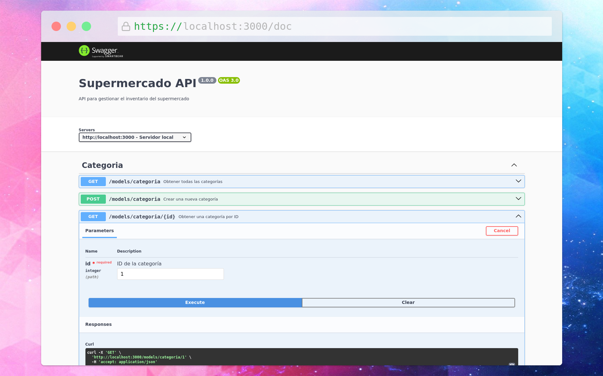

# Sistema de gestión de inventario
## Integrantes
- Jonathan David Viveros cordoba
- José Gabriel Tovar Gómez
- Eliana Jackeline Zambrano Cardenas

## Acerca de
Este repositorio contiene el backend junto con los archivos necesarios para contenerizar y desplegar tanto el servidor de nodejs como la base de datos PostgreSQL utilizando docker compose

## Despliegue
Para desplegar este proyecto es necesario contar con docker y docker compose, mas información sobre como instalarlo [aquí](https://docs.docker.com/engine/install/)

Se levantan los contenedores utilizando el siguiente comando:
```bash  
docker compose up -d
```

En caso de que se haga un cambio al servidor es necesario reconstruir el contenedor, por lo cual se añade la siguiente bandera al comando:
```bash
docker compose up --build -d
```

Para detener el servidor y la base de datos se ejecuta el siguiente comando:
```bash
docker compose down
```

Por defecto el servidor se ejecuta en `http://localhost:3000`

## Endpoints
La documentación se puede acceder de manera interactiva en `http://localhost:3000/doc` una vez se haya levantado el servidor.



